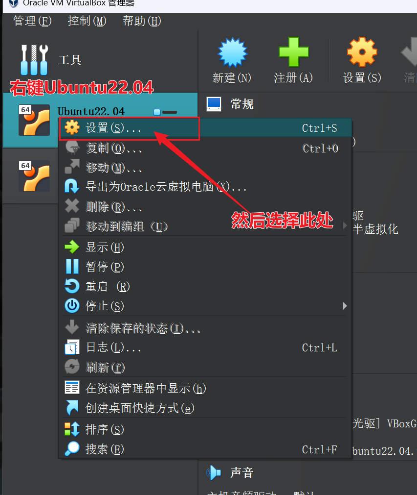
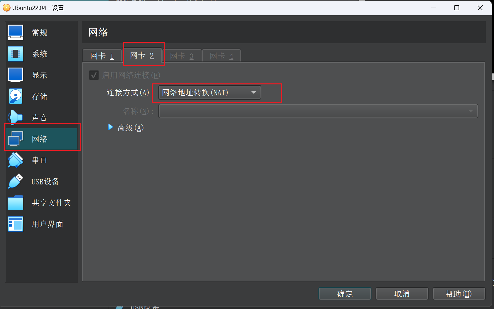
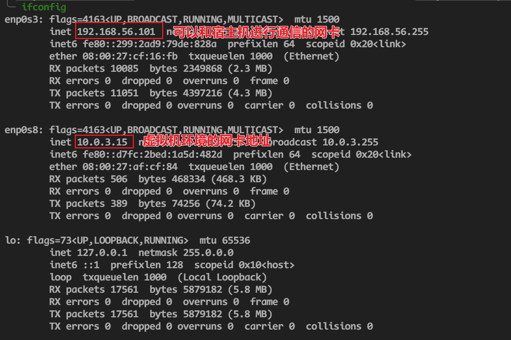
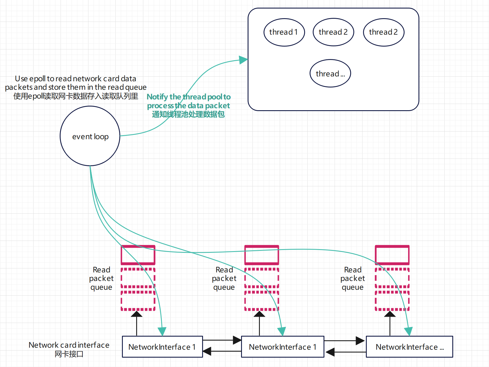

## NetStack
小型TCP/IP协议栈,用于学习网络知识
用到的技术:
> 1. 单例
> 2. 时间轮
> 3. 线程池
> 4. 原子锁    
> 5. 还有简单使用一些模板技术   

技术不难,主要是用来学习网络栈的基本协议,自己实现会有更深刻体会

## 环境配置
### 参数
系统: Ubunt22.04   
环境: Virtual Box虚拟机    
g++ 11.04、gdb、cmake    
C++版本: 17

### Virtual Box配置 
需要配置两个网卡,一个用来和宿主机进行通信,一个是系统自带的网卡.   

第一个网卡使用Host-Only网络

第二个网卡使用NAT,用来和宿主机通信


此时我们在虚拟机环境下执行命令,就有两个网卡了.代码运行后会自动获取网卡信息,剩下就不需要配置什么了.



## 项目架构(不是最终)


## 测试代码
项目目录: ```src/test/test.cpp```
